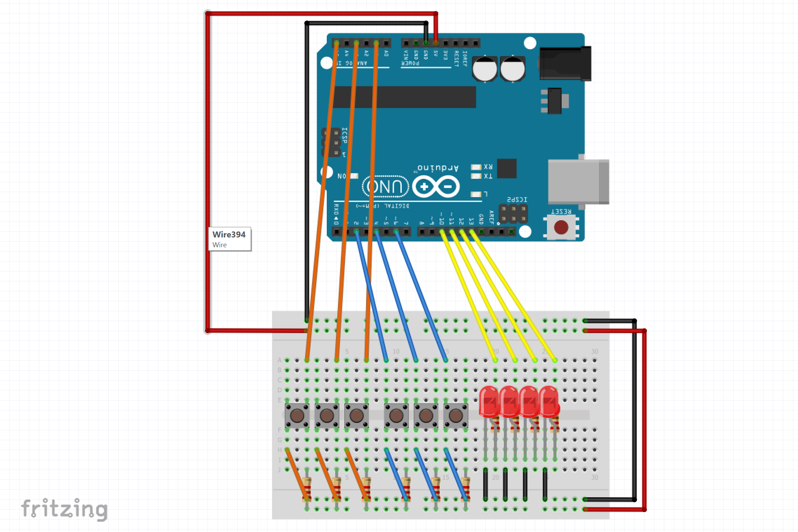
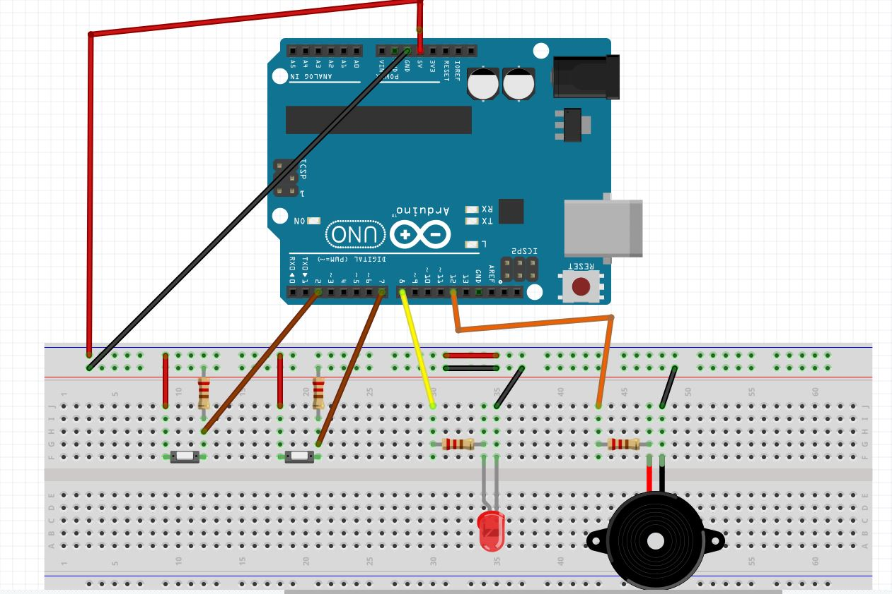
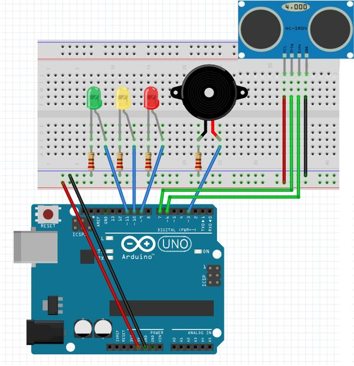

# Arduino Repository

This repository contains various Arduino projects and sketches.

## Projects

- [3 Bit Binary Calculator](./3_bit_binary_calculator): A simple calculator that performs addition and subtraction on 3-bit binary numbers.
    
- [Arduino Keyboard](./arduino_keyboard): An Arduino-based keyboard that can be used as a HID device.
    
- [Bar Graph](./bar_graph): A project that displays a bar graph using LEDs.
    
- [Help Blind](./help_blind): A project that assists visually impaired individuals with navigation.
- [Morse Code Communication](./morse_code_communication): A project that enables communication using Morse code.
    
- [Pattern](./pattern): A project that generates various patterns using LEDs.
- [Ping Pong](./ping_pong): A simple ping pong game implemented on Arduino.
- [RGB](./rgb): A project that controls RGB LEDs to display different colors.
- [Roman Number Converter](./roman_number_converter): A project that converts Roman numerals to decimal numbers.
- [Security Monitoring Project](./security_monitoring_project): A project that monitors and alerts for security breaches.
- [Security](./security): A project that implements a basic security system using Arduino.
    
- [Ultra](./ultra): A project that uses ultrasonic sensors for distance measurement.
    

## Contributing

Contributions are welcome! If you have any ideas, suggestions, or bug reports, please open an issue or submit a pull request. Make sure to follow the [contribution guidelines](CONTRIBUTING.md).

## License

This project is licensed under the [MIT License](LICENSE).

## Contact

For any questions or inquiries, please contact [meghamgarg@gmail.com](mailto:meghamgarg@gmail.com).
